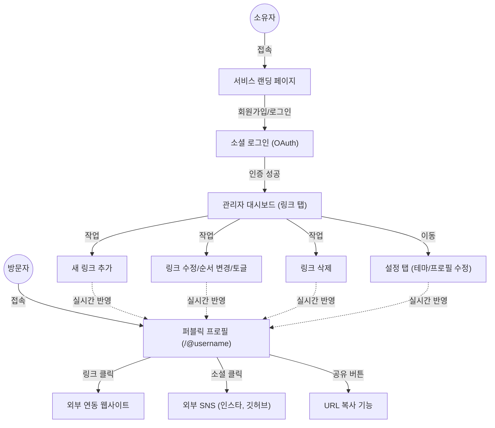

# 화면 설계서 (Wireframe) - 마이링크 (MyLink)

본 문서는 마이링크(MyLink) 서비스의 주요 화면인 **퍼블릭 프로필 페이지(방문자 뷰)**와 **링크 관리 대시보드(소유자 뷰)**의 레이아웃 구조를 시각화한 와이어프레임입니다.

---

## 1. 애플리케이션 플로우 (Mermaid Architecture)

사용자(방문자 및 소유자)가 애플리케이션 내에서 거치는 주요 흐름과 상호작용 구조입니다.



---

## 2. 화면 레이아웃 (ASCII Art Wireframe)

### 2.1 퍼블릭 프로필 페이지 (모바일 뷰 기준)
방문자가 고유 주소로 접속했을 때 보게 되는 모바일 최적화 웹 페이지입니다.

```text
+-------------------------------------------------+
|                                                 |
|                                       [ Share ] |
|                                                 |
|                 ( Profile )                     |
|                 ( Picture )                     |
|                                                 |
|               @jiyun_mylink                     |
|  "안녕하세요! 바이브 코딩을 배우고 있습니다."   |
|                                                 |
|       [IG]   [GH]   [TW]   [YT]                 |
|                                                 |
|  +-------------------------------------------+  |
|  |           My Tech Blog 🚀                 |  |
|  +-------------------------------------------+  |
|                                                 |
|  +-------------------------------------------+  |
|  |           Recent Portfolio 💼             |  |
|  +-------------------------------------------+  |
|                                                 |
|  +-------------------------------------------+  |
|  |           Contact Me 📧                   |  |
|  +-------------------------------------------+  |
|                                                 |
|                 Powered by MyLink               |
+-------------------------------------------------+
```
**주요 요소 설명**:
- `[ Share ]`: 페이지의 링크를 복사하여 카카오톡 등에 전달할 수 있는 공유 버튼.
- `( Profile Picture )`: 소유자의 프로필 사진. (없을 시 기본 이미지)
- `[IG] [GH]`: 소셜 미디어 아이콘 링크 (인스타그램, 깃허브 등).
- `[ ... ]`: 소유자가 추가한 핵심 멀티 링크 버튼. 클릭 시 해당 URL로 이동.

---

### 2.2 소유자 관리 대시보드 (데스크탑/태블릿 뷰 기준)
소유자가 로그인하여 링크를 등록, 수정, 삭제하는 관리자 페이지입니다.

```text
+-----------------------------------------------------------------+
|  [MyLink Logo]                                       [Logout]   |
+-----------------------------------------------------------------+
|                                                                 |
|  [ Preview (미리보기) ]      [ Links (링크) ]  [ Settings (설정) ]|
|                                                                 |
|                              +-------------------------------+  |
|                              |  + Add New Link (링크 추가)   |  |
|                              +-------------------------------+  |
|                                                                 |
|                               +-----------------------------+   |
|                           ⣿   | My Tech Blog 🚀             | [Toggle:ON] 
|                           ⣿   | https://blog.jiyun.com      | [Trash 🗑] 
|                               +-----------------------------+   |
|                                                                 |
|                               +-----------------------------+   |
|                           ⣿   | Recent Portfolio 💼         | [Toggle:ON]
|                           ⣿   | https://portfolio.jiyun.com | [Trash 🗑] 
|                               +-----------------------------+   |
|                                                                 |
|                               +-----------------------------+   |
|                           ⣿   | Contact Me 📧               | [Toggle:OFF]
|                           ⣿   | mailto:jiyun@example.com    | [Trash 🗑] 
|                               +-----------------------------+   |
|                                                                 |
+-----------------------------------------------------------------+
```
**주요 요소 설명**:
- `[ Preview / Links / Settings ]`: 탭 네비게이션으로, 현재 링크 탭이 활성화된 상태.
- `[ + Add New Link ]`: 새로운 링크를 추가하는 폼을 여는 버튼.
- `⣿` (Drag Handle): 마우스로 잡고 위아래로 끌어다 놓아(Drag & Drop) 사용자 페이지 내 노출 순서를 변경.
- `[Toggle:ON/OFF]`: 해당 링크 카드의 활성화/비활성화 스위치. (삭제 없이 숨김 처리 가능)
- `[Trash]`: 링크 삭제 휴지통 아이콘 버튼.
